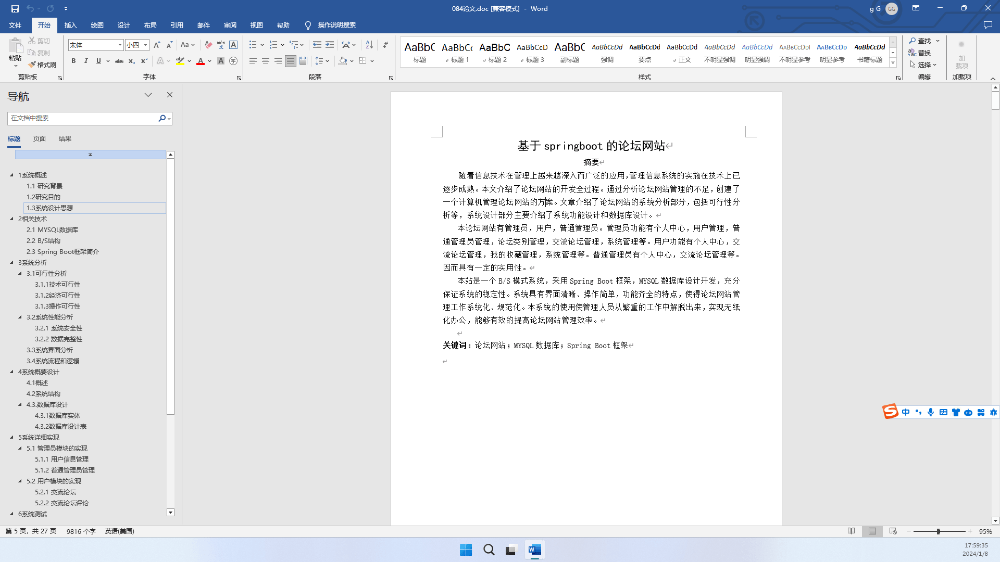
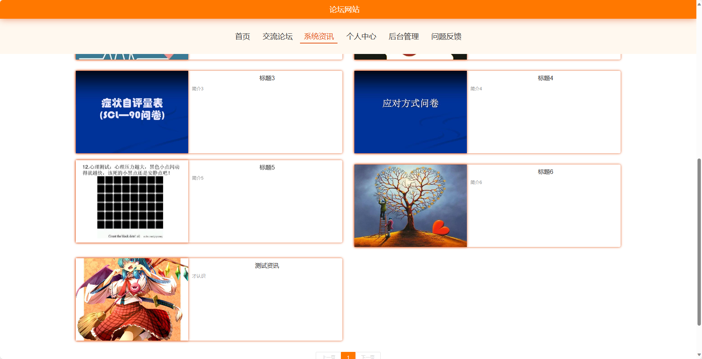
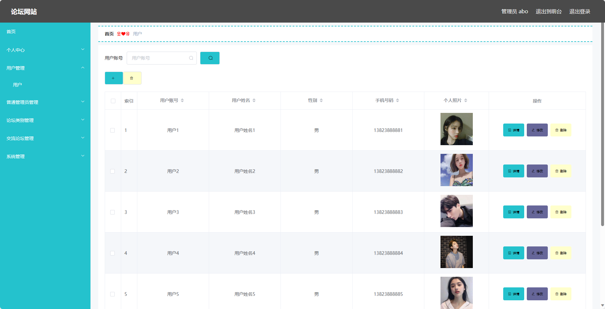

## 基于SpringBoot的论坛网站(程序+报告)

- <b>完整代码获取地址：从戎源码网 ([https://armycodes.com/](https://armycodes.com/))</b>
- <b>技术探讨、资料分享，请加QQ群：692619798</b> 
- <b>作者微信：19941326836  QQ：952045282</b> 
- <b>承接计算机毕业设计、Java毕业设计、Python毕业设计、深度学习、机器学习</b>
- <b>选题+开题报告+任务书+程序定制+安装调试+论文+答辩ppt 一条龙服务</b>
- <b>所有选题地址 ([https://github.com/YuLin-Coder/AllProjectCatalog](https://github.com/YuLin-Coder/AllProjectCatalog)) </b>

## 项目介绍
基于SpringBoot的论坛网站，系统包含两种角色：管理员、用户,系统分为前台和后台两大模块，主要功能如下。

### 【管理员】:
- 个人中心：管理员可以在个人中心查看和编辑个人信息。
- 用户管理：管理员可以管理用户，包括查看用户列表、编辑用户信息、删除用户等操作。
- 普通管理员管理：管理员可以管理普通管理员，包括添加新的普通管理员、编辑管理员信息、删除管理员等操作。
- 论坛类别管理：管理员可以管理论坛的类别，包括添加新的类别、编辑类别信息、删除类别等操作。
- 交流论坛管理：管理员可以管理交流论坛，包括置顶、删除、编辑帖子、屏蔽用户等操作。
- 系统管理：管理员可以管理系统设置。

### 【前台】:
- 首页：展示论坛网站的主页，包括热门帖子、最新资讯等信息。
- 交流论坛：用户可以在交流论坛中发帖、回帖，与其他用户进行讨论和交流。
- 系统资讯：展示论坛网站的最新资讯。
- 个人中心：用户可以在个人中心查看和编辑个人信息，包括头像、昵称、个人简介等。
- 问题反馈：用户可以向管理员反馈问题。

## 项目技术
- 编程语言：Java
- 数据库：MySQL
- 项目管理工具：Maven
- 前端技术：HTML、CSS、JavaScript、Jquery、Vue
- 后端技术：Spring、SpringMVC、MyBatis

## 运行环境
- JDK版本：JDK1.8及以上
- 开发工具：IDEA、Ecplise、Myecplise都可以
- 数据库: MySQL5.7及以上
- Maven：maven3.0及以上
- Node：14.14.0及以上

## 运行截图

